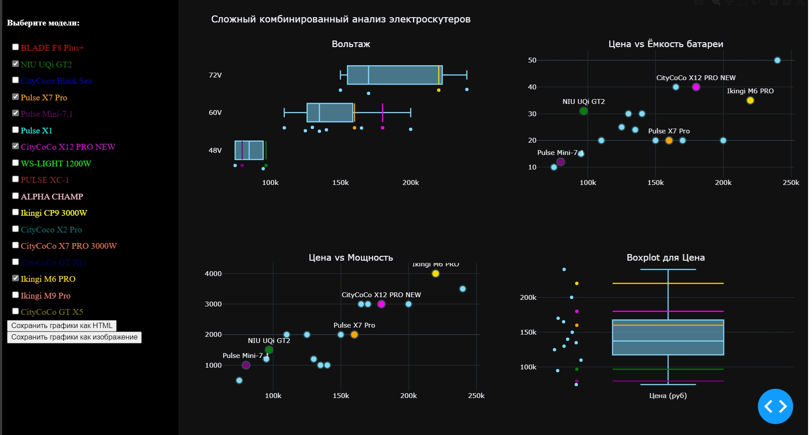
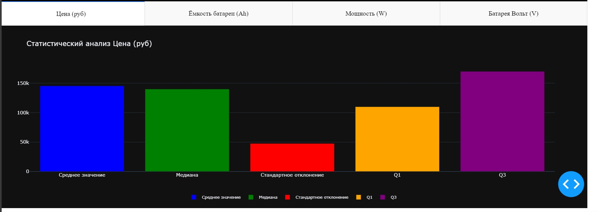

### 🌐 Language Selection | Выбор языка | Wybór języka

#### 📊 Program 1: Average Salary Analysis by Cities | Анализ средней зарплаты по городам | Analiza średnich wynagrodzeń w miastach

Русский

Эта программа на Python анализирует данные о зарплатах по городам с использованием библиотеки pandas. Она загружает данные из CSV файла, группирует их по столбцу "City", вычисляет средние значения зарплат для каждого города и отображает результат.

**Используемые библиотеки:**
- pandas

**Ключевые шаги:**
1. Импортирование библиотеки pandas.
2. Загрузка данных из CSV файла.
3. Группировка данных по городам и расчет средней зарплаты.
4. Отображение результатов.

English

This Python program analyzes salary data by cities using the pandas library. It loads data from a CSV file, groups it by the "City" column, calculates the average salary for each city, and displays the result.

**Libraries used:**
- pandas

**Key steps:**
1. Importing the pandas library.
2. Loading data from a CSV file.
3. Grouping data by city and calculating the average salary.
4. Displaying the results.

Polski

Ten program w języku Python analizuje dane dotyczące wynagrodzeń w miastach za pomocą biblioteki pandas. Ładuje dane z pliku CSV, grupuje je według kolumny "City", oblicza średnie wynagrodzenie dla każdego miasta i wyświetla wynik.

**Używane biblioteki:**
- pandas

**Kluczowe kroki:**
1. Importowanie biblioteki pandas.
2. Ładowanie danych z pliku CSV.
3. Grupowanie danych według miasta i obliczanie średniego wynagrodzenia.
4. Wyświetlanie wyników.

---

#### 🛒 Program 2: Translation and Analysis of E-commerce Product Data | Перевод и анализ данных о продуктах электронной коммерции | Tłumaczenie i analiza danych o produktach e-commerce

Русский

Этот проект включает скрипты на Python для обработки и перевода данных из CSV-файла с информацией о продуктах электронной коммерции. Скрипты загружают данные, переводят названия колонок и значений, а также выводят ключевую информацию и статистические описания набора данных.

**Используемые библиотеки:**
- pandas

**Ключевые шаги:**
1. Импортирование библиотеки pandas.
2. Загрузка данных из CSV файла.
3. Перевод названий колонок и значений.
4. Сохранение переведенного DataFrame в новый CSV файл.
5. Анализ данных: вывод ключевой информации и статистического описания.

English

This project includes Python scripts for processing and translating data from a CSV file containing e-commerce product information. The scripts load the data, translate column names and values, and output key information and statistical descriptions of the dataset.

**Libraries used:**
- pandas

**Key steps:**
1. Importing the pandas library.
2. Loading data from a CSV file.
3. Translating column names and values.
4. Saving the translated DataFrame to a new CSV file.
5. Analyzing data: displaying key information and statistical descriptions.

Polski

Ten projekt zawiera skrypty w języku Python do przetwarzania i tłumaczenia danych z pliku CSV zawierającego informacje o produktach e-commerce. Skrypty ładują dane, tłumaczą nazwy kolumn i wartości, a także wyświetlają kluczowe informacje i opisy statystyczne zbioru danych.

**Używane biblioteki:**
- pandas

**Kluczowe kroki:**
1. Importowanie biblioteki pandas.
2. Ładowanie danych z pliku CSV.
3. Tłumaczenie nazw kolumn i wartości.
4. Zapis przetłumaczonego DataFrame do nowego pliku CSV.
5. Analiza danych: wyświetlanie kluczowych informacji i opisów statystycznych.

---

#### 🛴 Program 3: Electric Scooter Data Analysis | Анализ данных по электрическим самокатам | Analiza danych hulajnóg elektrycznych

Русский

Эта программа на Python анализирует и отображает различные статистические данные для разных моделей электрических самокатов. Она включает создание DataFrame из предоставленных данных, сохранение его в CSV файл и вычисление основных статистических показателей, таких как среднее значение, медиана и стандартное отклонение для каждого числового параметра.

**Возможности:**
- **Создание DataFrame**: Построение DataFrame с использованием pandas на основе данных о различных моделях электрических самокатов.
- **Экспорт в CSV**: Сохранение DataFrame в CSV файл с именем `electric_scooters.csv`.
- **Проверка данных**: Отображение первых 4 строк DataFrame для проверки данных.
- **Статистический анализ**: Вычисление и вывод средних, медианных значений и стандартного отклонения для каждого числового параметра (цена, напряжение батареи, ёмкость батареи и мощность).
- **Описательная статистика**: Вывод подробного статистического резюме для каждого параметра, включая количество, среднее, стандартное отклонение, минимальное значение, 25-й перцентиль, медиану, 75-й перцентиль и максимальное значение.

**Используемые библиотеки:**
- pandas

**Ключевые шаги:**
1. Импортирование библиотеки pandas.
2. Создание DataFrame с данными о моделях электрических самокатов.
3. Сохранение DataFrame в CSV файл.
4. Отображение первых 4 строк данных.
5. Вычисление средних значений, медиан и стандартного отклонения для каждого числового параметра.
6. Отображение подробного статистического резюме.

English

This Python program analyzes and displays various statistics for different models of electric scooters. It includes functionality to create a DataFrame from provided data, save it to a CSV file, and compute basic statistics such as mean, median, and standard deviation for each numerical parameter.

**Features:**
- **DataFrame Creation**: Constructs a DataFrame using pandas with data for different models of electric scooters.
- **CSV Export**: Saves the DataFrame to a CSV file named `electric_scooters.csv`.
- **Data Inspection**: Displays the first 4 rows of the DataFrame to verify the data.
- **Statistical Analysis**: Computes and prints the mean, median, and standard deviation for each numerical parameter (price, battery voltage, battery capacity, and power).
- **Descriptive Statistics**: Outputs a comprehensive summary of statistics for each parameter, including count, mean, standard deviation, min, 25th percentile, median, 75th percentile, and max values.

**Libraries used:**
- pandas

**Key steps:**
1. Importing the pandas library.
2. Creating a DataFrame with data on electric scooter models.
3. Saving the DataFrame to a CSV file.
4. Displaying the first 4 rows of data.
5. Calculating mean, median, and standard deviation for each numerical parameter.
6. Displaying a detailed statistical summary.

Polski

Ten program w języku Python analizuje i wyświetla różne statystyki dla różnych modeli hulajnóg elektrycznych. Zawiera funkcjonalność tworzenia DataFrame z podanych danych, zapisywania go do pliku CSV i obliczania podstawowych statystyk, takich jak średnia, mediana i odchylenie standardowe dla każdego numerycznego parametru.

**Funkcje:**
- **Tworzenie DataFrame**: Konstrukcja DataFrame przy użyciu pandas z danymi dla różnych modeli hulajnóg elektrycznych.
- **Eksport CSV**: Zapisuje DataFrame do pliku CSV o nazwie `electric_scooters.csv`.
- **Inspekcja danych**: Wyświetla pierwsze 4 wiersze DataFrame w celu weryfikacji danych.
- **Analiza statystyczna**: Oblicza i wyświetla średnią, medianę i odchylenie standardowe dla każdego numerycznego parametru (cena, napięcie baterii, pojemność baterii i moc).
- **Statystyki opisowe**: Wyświetla szczegółowe podsumowanie statystyk dla każdego parametru, w tym liczebność, średnią, odchylenie standardowe, min, 25 percentyl, medianę, 75 percentyl i wartości maksymalne.

**Używane biblioteki:**
- pandas

**Kluczowe kroki:**
1. Importowanie biblioteki pandas.
2. Tworzenie DataFrame z danymi o modelach hulajnóg elektrycznych.
3. Zapisanie DataFrame do pliku CSV.
4. Wyświetlenie pierwszych 4 wierszy danych.
5. Obliczenie średniej, mediany i odchylenia standardowego dla każdego numerycznego parametru.
6. Wyświetlenie szczegółowego podsumowania statystycznego.

---

#### 📊 Program 4: Plotting | Построения графиков | Budowa wykresow

Русский

Это репозиторий содержит веб-приложение на базе Dash для анализа и визуализации данных по различным моделям двухколёсных электрических транспортных средств. Приложение предоставляет интерактивный интерфейс для сравнения различных моделей на основе таких параметров, как цена, ёмкость батареи, напряжение и мощность. Пользователи также могут сохранять сгенерированные графики в формате HTML для дальнейшего использования.

**Возможности:**
- **Интерактивные графики**: Сравнение различных моделей с помощью интерактивных точечных графиков, диаграмм размаха и столбчатых диаграмм.
- **Настраиваемые представления**: Выбор конкретных моделей для выделения и сравнения.
- **Статистический анализ**: Просмотр подробного статистического анализа, включая среднее значение, медиану, стандартное отклонение и квартили.
- **Сохранение графиков**: Сохранение сгенерированных графиков в формате HTML для последующего использования.

**Примеры графиков:**

### Сложный комбинированный анализ

### Статическое сравнение - цена

**[Инструкция в папке Program_4_Plotting](./Program_4_Plottig/README_program_4.MD)**

English

This repository contains a Dash-based web application for analyzing and visualizing data on various models of two-wheeled electric vehicles. The application provides an interactive interface for comparing different models based on various parameters such as price, battery capacity, voltage, and power. Users can also save the generated graphs as HTML files for further use.

**Features:**
- **Interactive Graphs**: Compare different models using interactive scatter plots, box plots, and bar charts.
- **Customizable Views**: Select specific models to highlight and compare.
- **Statistical Analysis**: View detailed statistical analysis, including mean, median, standard deviation, and quartiles.
- **Save Graphs**: Save the generated graphs as HTML files for later use.

**Example Graphs:**

### Complex Combined Analysis

### Static Comparison - Price

**[Instructions in the Program_4_Plotting Folder](./Program_4_Plottig/README_program_4.MD)**

Polski

To repozytorium zawiera aplikację internetową opartą na Dash do analizowania i wizualizacji danych dotyczących różnych modeli dwukołowych pojazdów elektrycznych. Aplikacja zapewnia interaktywny interfejs do porównywania różnych modeli na podstawie różnych parametrów, takich jak cena, pojemność baterii, napięcie i moc. Użytkownicy mogą również zapisywać wygenerowane wykresy jako pliki HTML do dalszego użytku.

**Funkcje:**
- **Interaktywne wykresy**: Porównywanie różnych modeli za pomocą interaktywnych wykresów punktowych, wykresów pudełkowych i wykresów słupkowych.
- **Dostosowywane widoki**: Wybór konkretnych modeli do wyróżnienia i porównania.
- **Analiza statystyczna**: Wyświetlanie szczegółowej analizy statystycznej, w tym średniej, mediany, odchylenia standardowego i kwartylów.
- **Zapisywanie wykresów**: Zapisywanie wygenerowanych wykresów jako plików HTML do późniejszego użytku.

**Przykłady wykresów:**

### Złożona analiza kombinowana

### Statyczne porównanie - cena

**[Instrukcja w folderze Program_4_Plotting](./Program_4_Plottig/README_program_4.MD)**

